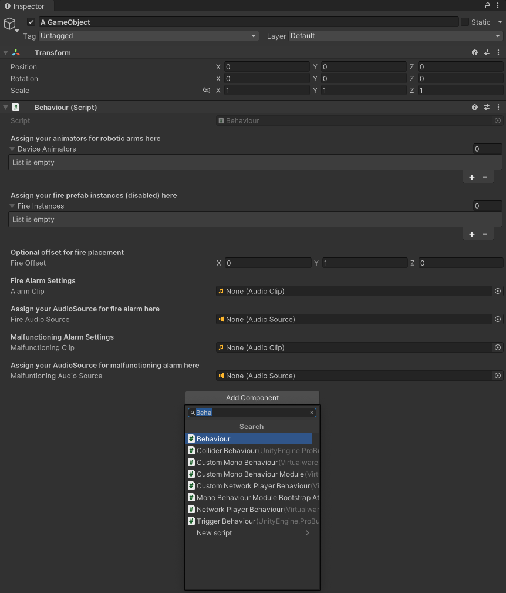
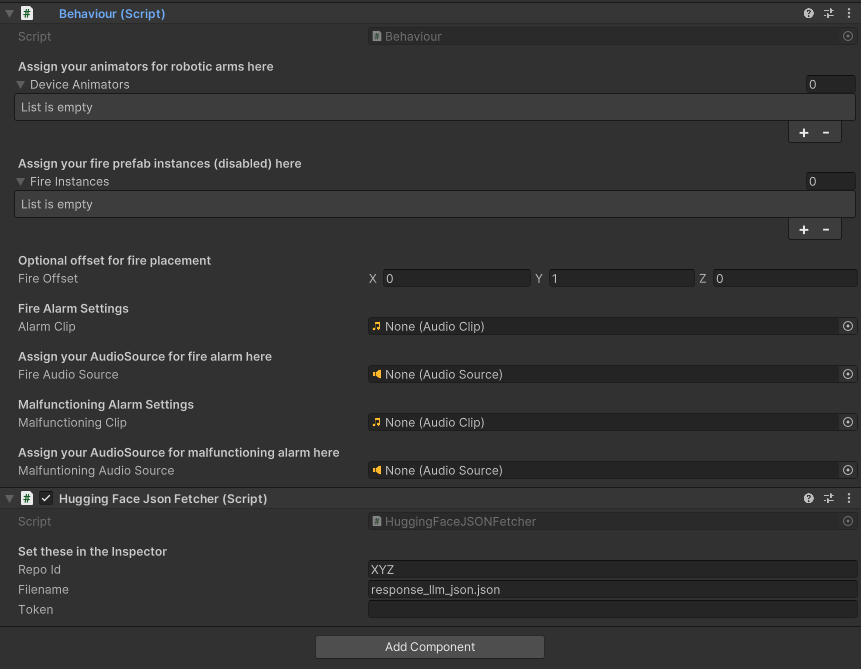
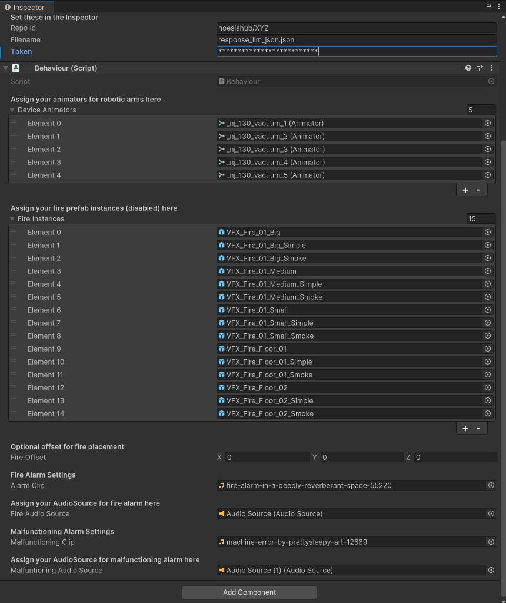

# XR Scenario Creator

## 1 Components Implemented

Two key components have been developed:
- **BusinessLogic** component
- **HuggingFaceJsonFetcher** component

The `BusinessLogic` is designed to accommodate the virtual robotic arms used in your Unity scene. You can assign it via the Unity Inspector, as shown below:


*Example showing the BusinessLogic component fields in the Unity Inspector.*

---

## 2 BusinessLogic Component Fields Overview

All fields listed below are customizable for flexibility across different environments and training goals.

| Field Name                   | Type         | Description                              |
|-----------------------------|--------------|------------------------------------------|
| `deviceAnimators`           | Animator[]   | Robotic Devices with Animators attached  |
| `fireInstances`             | GameObject[] | Prefabs for fire effects                 |
| `fireOffset`                | Vector3      | Offset to place fire effects             |
| `alarmClip`                 | AudioClip    | Sound to play during fire incident       |
| `fireAudioSource`           | AudioSource  | Audio source for fire alarms             |
| `malfunctioningClip`        | AudioClip    | Sound to play during malfunction incident|
| `malfuntioningAudioSource`  | AudioSource  | Audio source for malfunction alerts      |

---

### 2.1 BusinessLogic Component Field Descriptions

#### 2.1.1 `deviceAnimators` (Animator[])
A list of Animator components. Assign any GameObject (e.g., robotic arms) that contains an Animator. If no Animator is present, it will not work.

#### 2.1.2 `fireInstances` (GameObject[])
A pool of disabled fire prefabs placed in the scene. The script will activate one randomly during a fire event.

#### 2.1.3 `fireOffset` (Vector3)
Offset where the fire prefab appears relative to the device. Default is `(0, 1, 0)`.

#### 2.1.4 `alarmClip` (AudioClip)
The sound that plays during a fire incident. Use a looping alarm or suitable alert.

#### 2.1.5 `fireAudioSource` (AudioSource)
Audio source used to play `alarmClip`.

#### 2.1.6 `malfunctioningClip` (AudioClip)
Audio clip triggered when a malfunction event occurs.

#### 2.1.7 `malfuntioningAudioSource` (AudioSource)
Audio source used to play the `malfunctioningClip`.

---

## 3 Unity Integration Guide – HuggingFace JSON Fetcher

This section explains how to use the `HuggingFaceJsonFetcher` Unity component alongside `BusinessLogic` to create automated, LLM-driven VR scenarios using structured JSON input. 

The trainer promets in the provided LLM, the desired scenario (fire, malfuncationing incident or even both) and the LLM return a selection of the selected robotic arm which will virtually be set on fire. 
When the traineed start the VR application, the library retrieves the structured ouput of the LLM, which indicated the robotic devices to be set on fire, malfunction or in case of a combination (a selection of max. 2 robotic devices) of the incidents which coresponding robotic device suffers which disaster.

An example structured output is shown here, presenting also the JSON structure of the ouput:

```json
{
  "Robotic_Arm_Virtual_Fire": 1,
  "Robotic_Arm_Malfunctioning": 2,
  "Reason_of_selection": "Robotic Arm Number 1 is the closest to the base with a distance of 1.43, which aligns with the description of the virtual fire being 'close to the base.' Robotic Arm Number 2, at a distance of 7.79, is the farthest and matches the description of the arm 'moving erratically at a far distance,' indicating it is potentially malfunctioning."
}
```

This component, retrieves the LLM structured output from a dataset repository, which must be created in HuggingFace (see the corresponding documentation). In order to successfuly retrieve this information, we have to correctly set the following fields, show in the table below:

| Parameter | Type   | Description |
|----------|--------|-------------|
| repoId | string | Hugging Face dataset repository ID (e.g., username/dataset_name). |
| filename | string | JSON file name inside the dataset. |
| token | string | (Optional) Hugging Face access token. Required for private datasets. |

  
*Example showing the HuggingFaceJsonFetcher component fields in the Unity Inspector.*

---

Below we show how a fully configured BusinessLogic and HuggingFaceJsonFetcher component looks like.

  
*Example showing how both components can be configured in the Unity Inspector. This is a fully functional configuration.*

### 3.1 HuggingFaceJsonFetcher Field Descriptions

#### 3.1.1 `repoId` (string)
The repoId is the name of the created dataset in Hugging Face (this is also the name that must be used in the LLM module in HugginFace). No links or any url of any kind is needed, only the profile name followed with the dataset name e.g. my-user-name/dataset-name. Inside this repository there must be at least one file (default can be the file with name response_llm_json.json
) in which the LLM will write its structured output.

#### 3.1.2 `filename` (string)
The name of the file the LLM writes the structured output in the designated dataset (see above field).

#### 3.1.3 `token` (string)
In order to access the Hugging Face dataset, we need to create a token from the Hugging Face user account in order for the library to be authenticated and authorized to access the file mentioned above (same logic as in github, gitlab, etc). Refer to this [link](https://huggingface.co/docs/hub/en/security-tokens) for additional information on this topic. Be aware to set the correct priviledges, otherwise the library will now be able to access the file, resulting in a 401 error response.

>**BE CAREFULL not to publish or accidentally share the generated token. Line other tokens, is must not be publically available!**